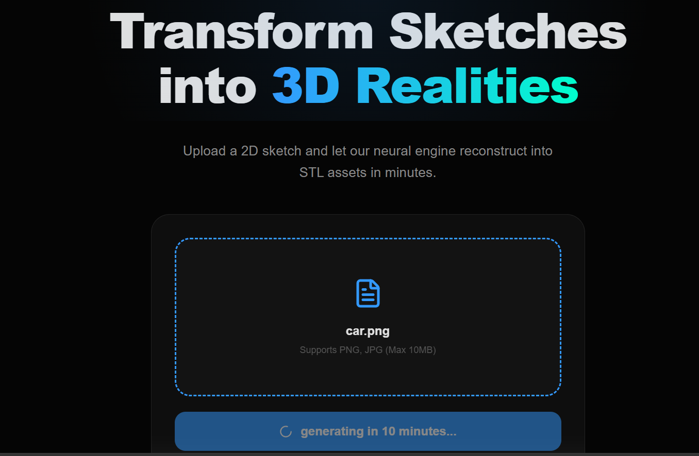
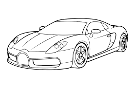
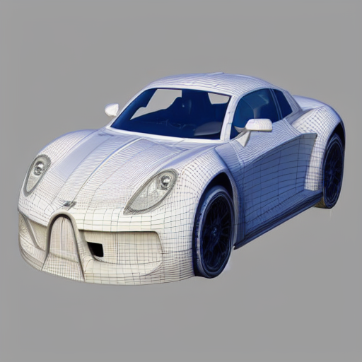
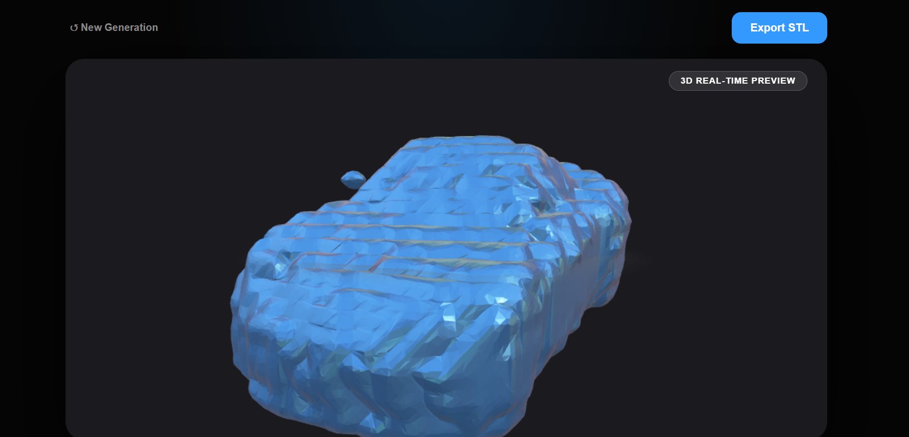

# Text/Sketch to 3D generator

This is a Full stack Application that uses React , Nodejs , Expressjs and python.
The system integrates a web-based frontend, backend API, and an AI engine for 3D reconstruction.

---


### Working

* Upload-based 3D generation pipeline
* Interactive frontend UI
* Backend API integration

---

## Visuals
<p align="center">
  
</p>

## INPUT

<p align="center">
  
</p>

### Concept Image (ControlNet Output)
<p align="center">
  
</p>

### Generated Output ( Inside the STL viewer)

<p align="center">
  
</p>

---


### Pipeline

## Data Flow ( inside of the AI engine)

1) The AI engine accepts three input types when first run through run.py : **type**, **multiview**, and **data** (such as a text prompt or a path to a sketch/image). Based on the selected input type, the pipeline can route it through <i>text2img</i> or <i>sketch2img</i>.

2) If a text prompt is provided, it is passed into **Stable Diffusion 3** (currently under development) to generate a concept image. For sketch-based input, the sketch is processed using **ControlNet**, which converts it into a structured image suitable for further reconstruction.

3) Once a concept image is generated, it can optionally be passed into **Zero123** for multi-view synthesis (currently not working), where multiple perspectives of the object are generated. Alternatively, the image is directly forwarded to the reconstruction stage.

4) In the final stage, the image is processed by **TripoSR**, which generates a 3D representation and exports it as an `.stl` file. This file is then converted into a `mesh.obj` format and further refined using **Trimesh** utilities for smoothing and cleanup.

Overall pipeline:

Input → Image Generation (Stable Diffusion / ControlNet) → (Optional Multi-view via Zero123) → 3D Reconstruction (TripoSR) → Mesh Processing (Trimesh) 

---

### In Progress / Known Issues

* Text-to-3D generation not working (model integration incomplete)
* Multi-view generation not functioning correctly. Some issues in zero123 library.
* Output consistency issues across runs.

---

## Tech Stack

* Frontend: React
* Backend: Node.js + Express
* GenerativeAI: Python
* Other Tools: REST APIs, file-based processing


---

## Project Structure

```bash
3D_Model_Gen/
├── client/        # React frontend
├── server/        # Node.js backend
├── ai_engine/     # Python AI processing
```

---

## Setup Instructions


### 1. Setup Frontend

```bash
cd client
npm install
npm start
```

---

### 2. Setup Backend

```bash
cd ../server
npm install
npm run dev
```

---

### 3. Setup AI Engine

```bash
cd ../ai_engine
pip install -r requirements.txt
```

---

## Roadmap

* Fix text-to-3D generation pipeline
* Implement working multi-view generation
* Improve model stability and output quality
* Optimize backend–AI communication

---

## Notes

* This project is under active development
* Uses TripoSR for 3D reconstruction


